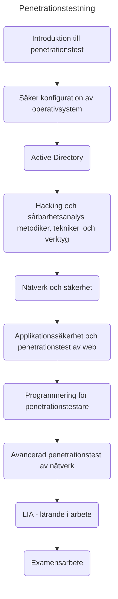

# penetrationstestare

```mermaid
---
title: Penetrationstestning
---
flowchart TD
    id01(Introduktion till penetrationstest)
    id02(Säker konfiguration av operativsystem)
    id03(Active Directory)
    id04(Hacking och sårbarhetsanalys metodiker, tekniker, och verktyg)
    id05(Nätverk och säkerhet)
    id06(Applikationssäkerhet och penetrationstest av web)
    id07(Programmering för penetrationstestare)
    id08(Avancerad penetrationstest av nätverk)
    id09(LIA - lärande i arbete)
    id10(Examensarbete)
    id01-->id02
    id02-->id03
    id03-->id04
    id04-->id05
    id05-->id06
    id06-->id07
    id07-->id08
    id08-->id09
    id09-->id10
```

